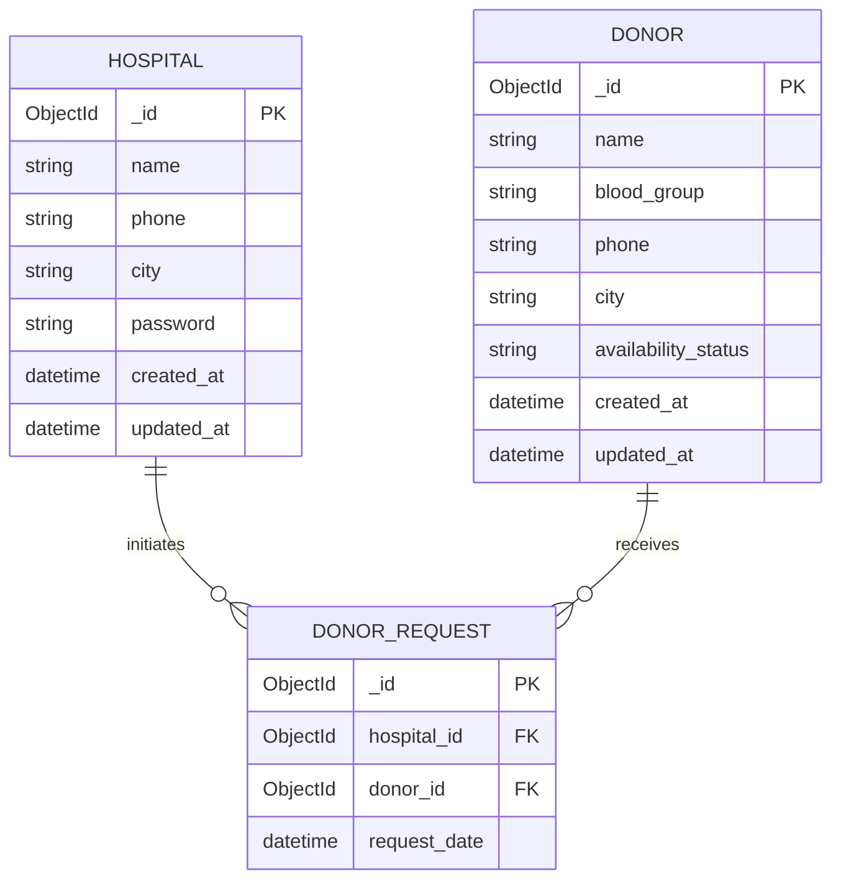

# Database Technical Report

## 1. Overview
This document details the database architecture for the Blood Donor Search Platform. The system uses **MongoDB** with **Mongoose** for object modeling.

## 2. Entity-Relationship Diagram (ERD)

## 3. Schema Collection Details

### 3.1. Donors Collection
Stores information about individuals registered to donate blood.

| Field | Type | Required | Constraints | Description |
| :--- | :--- | :--- | :--- | :--- |
| `_id` | ObjectId | Yes | PK | Unique identifier |
| `name` | String | Yes | Trimmed | Full name of the donor |
| `blood_group` | String | Yes | Enum | One of: `A+`, `A-`, `B+`, `B-`, `O+`, `O-`, `AB+`, `AB-` |
| `phone` | String | Yes | Trimmed | Contact number |
| `city` | String | Yes | Trimmed | City of residence |
| `availability_status` | String | Yes | Enum | Default: `Available`. Options: `Available`, `Unavailable` |
| `created_at` | Date | Yes | Auto | Timestamp of registration |
| `updated_at` | Date | Yes | Auto | Timestamp of last update |

### 3.2. Hospitals Collection
Stores credentials and profile information for hospitals/organizations.

| Field | Type | Required | Constraints | Description |
| :--- | :--- | :--- | :--- | :--- |
| `_id` | ObjectId | Yes | PK | Unique identifier |
| `name` | String | Yes | Trimmed | Name of the hospital |
| `phone` | String | Yes | Trimmed | Login identifier (Unique recommended) |
| `city` | String | Yes | Trimmed | Location |
| `password` | String | Yes | Hashed | Bcrypt hashed password |
| `created_at` | Date | Yes | Auto | Account creation time |
| `updated_at` | Date | Yes | Auto | Last profile update time |

### 3.3. DonorRequests Collection
A junction table (log) tracking which hospital contacted which donor.

| Field | Type | Required | Description |
| :--- | :--- | :--- | :--- |
| `_id` | ObjectId | Yes | Unique Log ID |
| `hospital_id` | ObjectId | Yes | Reference to **Hospital** |
| `donor_id` | ObjectId | Yes | Reference to **Donor** |
| `request_date` | Date | Yes | Default: `Date.now` |

## 4. Relationships
1.  **Hospital -> DonorRequest**: One-to-Many. A hospital can make multiple requests.
2.  **Donor -> DonorRequest**: One-to-Many. A donor can receive multiple requests (logs).
3.  **Hospital -> Donor**: No direct database relationship. Logic depends on "Search" (City/Blood Group matching).

## 5. Indexes (Recommended)
*Currently not explicitly defined in schemas, but recommended for performance optimisation:*
- `Donor`: `{ blood_group: 1, city: 1, availability_status: 1 }` - Optimizes the primary search query.
- `Hospital`: `{ phone: 1 }` - Optimizes login lookup (should be unique).
